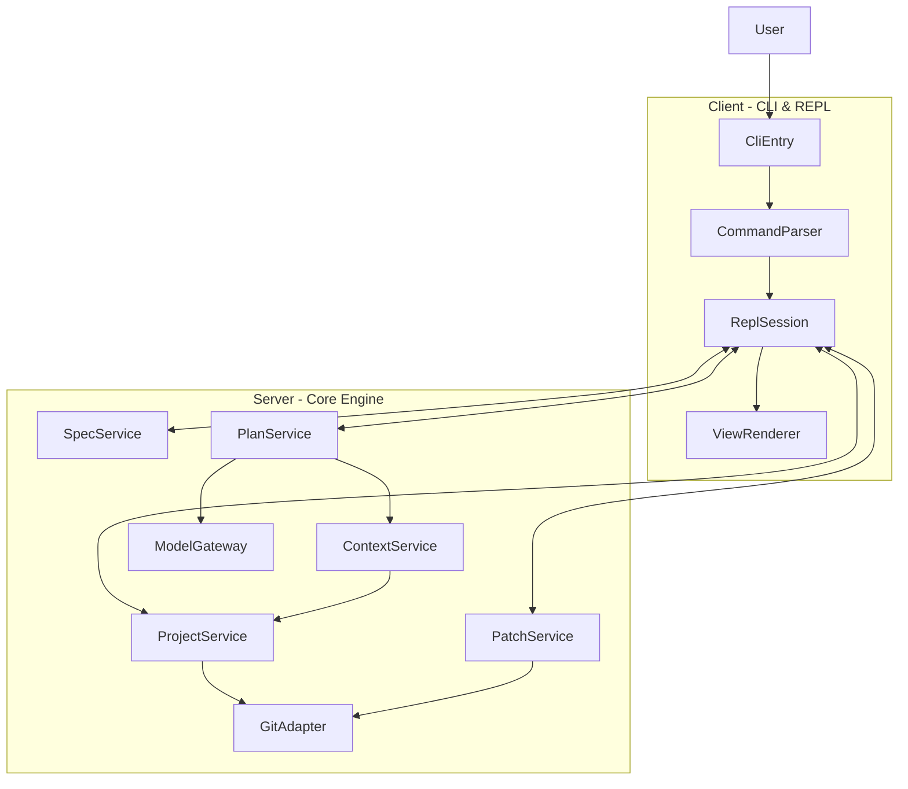

## MyCli 架构总览（C/S 视角）

MyCli 从工程师视角来看，是一个**本地 C/S 系统**：

- **Client（C）**：命令行入口 + 对话式 REPL；
- **Server（S）**：Core Engine + LLM 网关 + Git 适配层；
- 中心领域对象：`Project`、`Spec`、`Context`、`Plan`、`Patch`、`Session`。

---

### 高层架构图

> 说明：
> - 物理上 Client 和 Server 可以在同一进程内，用模块/包划分；
> - 未来如需远程化，只需把 `serverSide` 一侧变成 HTTP/gRPC 服务，Client 保持调用契约不变。

---

### 核心数据流：从 Spec / 对话到 Patch / Git

#### 1. 会话入口（Client）

- `CliEntry` 解析命令行：
  - `mycli chat` / `mycli repl`：进入 REPL 会话；
  - `mycli run -s spec.yml`：一次性执行完整链路。
- `ReplSession` 维护会话状态：
  - 当前 Project（路径、Git 状态）；
  - 当前 Spec（显式文件或由自然语言生成）；
  - 最近一次 Plan / Patch 集合。
- `CommandParser` 解析会话内指令：
  - 前缀命令（如 `:spec`、`:scope`、`:plan`、`:apply` 等）；
  - 普通自然语言（走 SpecBuilder + LLM）。

#### 2. Spec 与上下文（Server）

- `SpecService`：
  - 从文件或自然语言构建 `Spec` 对象；
  - 校验字段完整性和基本约束。
- `ProjectService`：
  - 校验当前目录是否 Git 仓库；
  - 提供文件枚举、读写、Git 状态等能力。
- `ContextService`：
  - 基于 `Spec.scope` / `Spec.context` 决定需要读取哪些文件；
  - 返回结构化上下文（文件路径 + 内容/片段）。

#### 3. 计划与补丁（Server + LLM）

- `PlanService`：
  - 调用 `PromptBuilder` 将 `Spec` + `Context` 组织成 Prompt；
  - 通过 `ModelGateway` 调用模型；
  - 把模型响应解析成 `Plan`（自然语言说明）+ 初步 `PatchDraft`。
- `PatchService`：
  - 将 `PatchDraft` 转为结构化 `Patch`（文件 + hunks）；
  - 提供 dry-run（只生成 diff）和 apply（真正写入文件）两种模式。
- `GitAdapter`：
  - 在 apply 后生成 `git diff`，供用户确认；
  - 按约定策略创建 commit（例如「每个 Spec 一次原子 commit」）。

---

### 与实现相关的几个约束

- **本地优先**：MVP 只考虑本地 Git 仓库，不做远程/跨仓库操作；
- **Spec 为中心**：所有 Server 侧服务都以 `Spec` 为入口，而不是直接基于原始自然语言；
- **可替换的模型网关**：`ModelGateway` 是唯一可以直接和外部 LLM 通讯的模块，上层不感知具体 Provider；
- **可服务化的 Server**：Server 侧保持「函数式接口」风格，未来可直接迁移为 HTTP/gRPC。

更细的模块职责和领域对象说明见 `docs/architecture/modules.md` 与 `docs/architecture/model-providers.md`。

